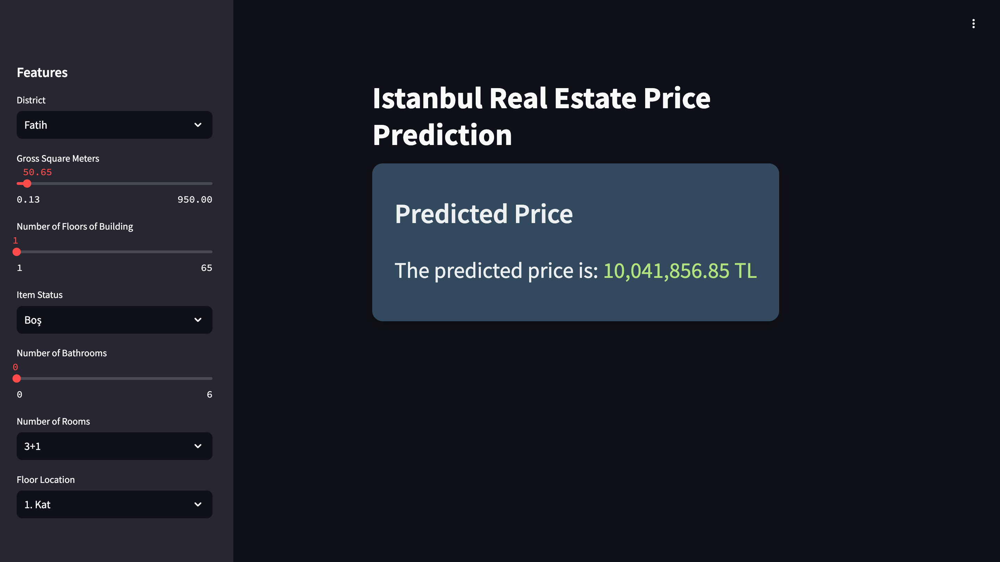
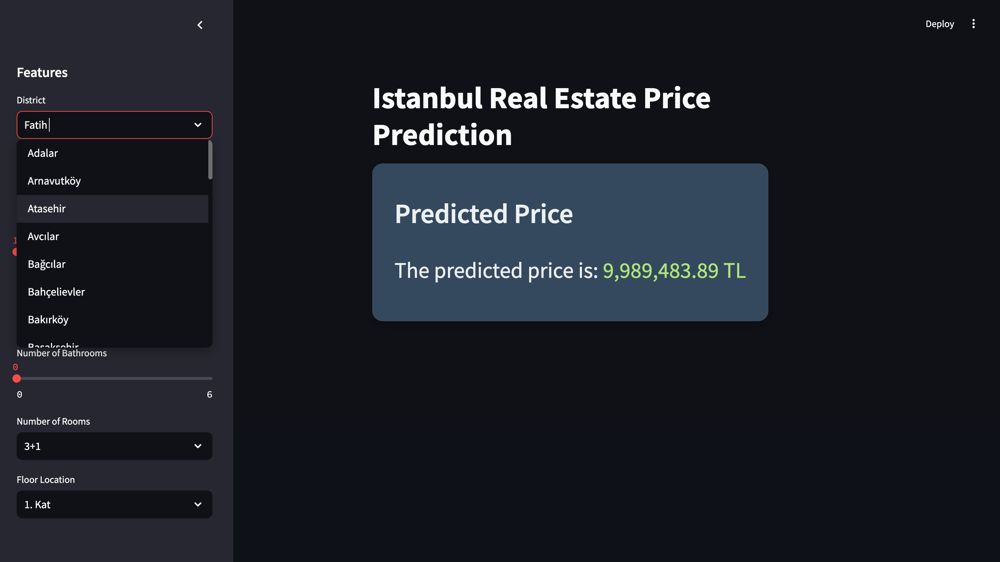

# Real Estate Price Prediction Project

This project aims to predict real estate prices in Istanbul using a machine learning model built with TensorFlow. The application not only predicts prices but also provides users with a frontend for interacting with the data.

## Project Structure

### Tools and Technologies

#### TensorFlow
TensorFlow is used for building and training the neural network model. This deep learning framework provides flexibility in defining the architecture of the model and enables efficient training with large datasets. The model in this project consists of fully connected layers (Dense layers) and is trained using a regression approach.

#### Neural Network Architecture
The model is composed of the following layers:
- **Input Layer**: Accepts the feature set of each property (e.g., district, gross square meters).
- **Hidden Layers**: Two hidden layers with 1024 neurons each, using the ReLU (Rectified Linear Unit) activation function. The ReLU activation is advantageous because it introduces non-linearity while maintaining efficient gradient propagation during training.
- **Output Layer**: A single neuron with a ReLU activation function that predicts the price of a property.

##### Why ReLU and Dense Layers?
- **Dense layers** (fully connected layers) ensure that every neuron in one layer is connected to every neuron in the next, allowing the model to learn complex patterns and relationships between input features.
- **ReLU activation** is chosen because it mitigates the vanishing gradient problem common in deeper networks and speeds up the convergence of the model.

#### Optimizer and Loss Function
- **Adam Optimizer**: Adam is selected for optimization due to its adaptive learning rate and efficient handling of sparse gradients. This allows for faster and more stable training.
- **MAPE Loss Function**: Mean Absolute Percentage Error (MAPE) is used as the loss function, which helps quantify the model’s performance in predicting prices relative to the actual values.

### Model Training and Validation
The model is trained on 60% of the dataset, while 20% is reserved for validation, and the remaining 20% is used for testing. The training process spans 1000 epochs to ensure the model sufficiently learns the underlying data patterns. After training, the model is evaluated based on mean absolute error (MAE) and the MAPE loss function.

## Frontend

The project includes a user-friendly frontend, which is designed for real estate users to input their property details and get an instant price prediction. The frontend is built using a Python framework that supports data input, processing, and displays the results in an intuitive manner. Here are some key features:
- **Interactive Inputs**: Users can select property features such as district, gross square meters, number of rooms, and more to get price predictions.
- **Price Visualization**: After training the predicted price alongside charts displayed for users to compare predicted vs. actual prices.
- **CSV Export**: The predictions generated can be exported as CSV files for further analysis.

The frontend provides a seamless experience for interacting with the model and understanding how various property features influence the predicted price.

## Acknowledgments

This project was completed during my internship at [ARDICTECH](https://www.ardictech.com/), and I would like to express my deep gratitude for their support and guidance throughout the process. I would also like to thank [Mirza Atlı](https://mirza.town/) for his unwavering mentorship and continuous encouragement during my internship. His expertise and guidance have been invaluable to the success of this project.

## License

This project is licensed under the AGPL-3.0 License - see the LICENSE file for details.
